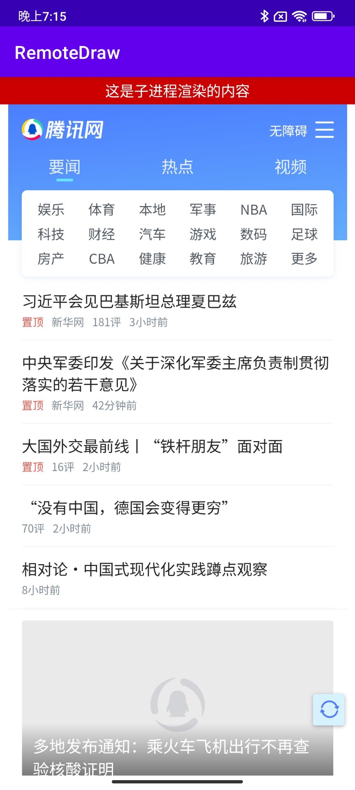

# Android 跨进程渲染

> 本项目用于验证 Android 是否能够跨进程渲染 View，最终实现了在子进程创建WebView，主进程显示的功能。

## 一、跨进程渲染的意义
- 有一些组件比如 WebView 如果在主进程初始化，会大大增加主进程的内存占用。
- 部分组件设计时只支持特定进程，但是又想在别的进程显示该组件的View
- 一些其它限制...
## 二、跨进程渲染的实现
### 1.提供一个``Surface``
跨进程渲染，需要一个``Surface``对象，本项目中使用``SurfaceView``提供。
而``Surface``实现了``Parcelable``接口，也就意味着它可以跨进程传递。

具体逻辑参考：``ProcessSurfaceView``，通过``bindService``拉起子进程``Service``后，将``Surface``通过接口传递给了子进程。
```kotlin
// bindService 拉起子进程
private fun bindService() {
    val intent = Intent(context, RemoteDrawService::class.java)
    context.bindService(intent, this@ProcessSurfaceView, Context.BIND_AUTO_CREATE or Context.BIND_IMPORTANT)
}

// 子进程连接后，拿到 AIDL 接口传递 Surface 到子进程
override fun onServiceConnected(p0: ComponentName?, iBinder: IBinder?) {
    Log.i(TAG, "onServiceConnected")
    if (iBinder == null) {
        Log.e(TAG, "onServiceDisconnected: iBinder is null.")
        return
    }
    iRemoteDraw = IRemoteDraw.Stub.asInterface(iBinder)
    setSurfaceToRemote()
}
```
ps:``SurfaceView``退后台需要额外处理，本项目中是在退后台后重新创建了渲染的View。
### 2.子进程创建View
收到主进程的``Surface``后，需要创建``VirtualDisplay``和``Presentation``。
```kotlin
val displayManager = service.getSystemService(Context.DISPLAY_SERVICE) as DisplayManager
val dm = service.resources.displayMetrics
val virtualDisplay = displayManager.createVirtualDisplay("", dm.widthPixels, dm.heightPixels, dm.densityDpi, surface, 0)
val presentation = Presentation(service, virtualDisplay.display)
presentation.setContentView(createView())
presentation.show()
```
至此，就实现了跨进程渲染。效果如下：

### 3.点击事件处理
由于渲染的View是在另外一个进程，所以收不到点击事件。这里的实现方案是将``SurfaceView``的点击事件跨进程传递到子进程。
```kotlin
override fun dispatchTouchEvent(event: MotionEvent?): Boolean {
    return iRemoteDraw?.dispatchTouchEvent(event) ?: false
}
```
由于是跨进程传递，事件的处理效率肯定变低了。因此跨进程渲染适合那些不怎么依赖点击事件的显示，比如播放视频。

## 三、优点和缺点
可见跨进程渲染的显示还是相对简单的，系统提供了相应的能力。使用时，需要注意其的限制。
**1.优点**
- 将渲染交给了其它进程，降低了本进程内存占用。
- 有一些业务场景只能通过跨进程渲染实现。

**2.缺点**
- 需要额外处理点击事件。包括如果需要跟渲染对象进行交互，都需要提供跨进程接口，处理效率变低。
- 复杂程度变高。